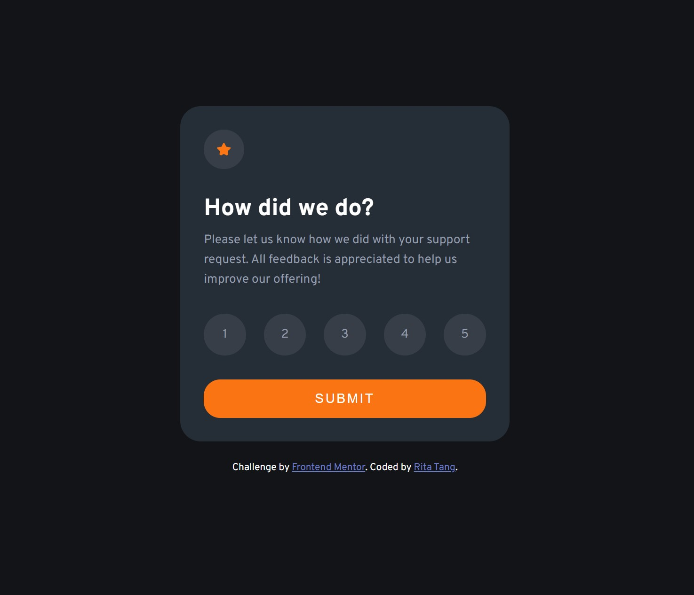
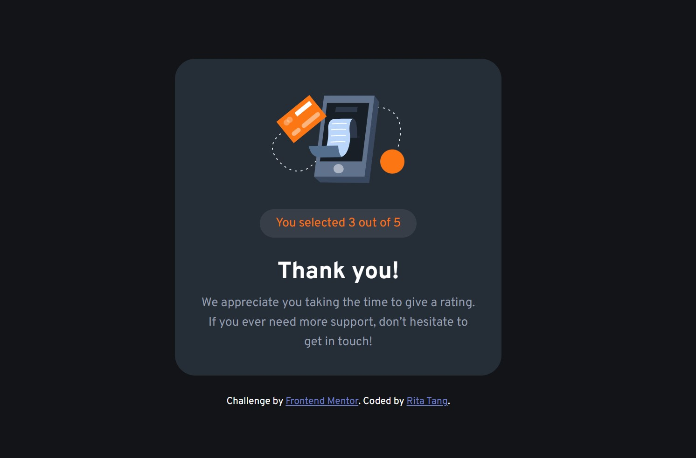

# Frontend Mentor - Interactive rating component solution

This is a solution to the [Interactive rating component challenge on Frontend Mentor](https://www.frontendmentor.io/challenges/interactive-rating-component-koxpeBUmI).

## Overview

The challenge is to build out the project and get it looking as close to the designs inside the `/design` folder as possible. Required assets are stored in the `/images` folder. 
User would pick a rating at the rating state, and the picked rating will be displayed at the thank you state.

### Screenshot
- Rating state design

  

- Thank you state design

  

### Links

- Solution URL: [Here](https://github.com/ritatanght/Interactive-rating-component)
- Live Site URL: [Here](https://ritatanght.github.io/Interactive-rating-component/)

### Built with

- Semantic HTML5 markup
- CSS custom properties
- Javascript
- Flexbox

### What I learned

In javascript, the code below can be used to select the checked radio button, as if using a CSS selector.

```js
let rating = document.querySelector("input[name=rating]:checked");
```

or when there is only one type of input:
```js
let rating = document.querySelector("input:checked");

```
**Note:** When none of the radio button is "checked", this selector would return null, so make sure to check for value first.
